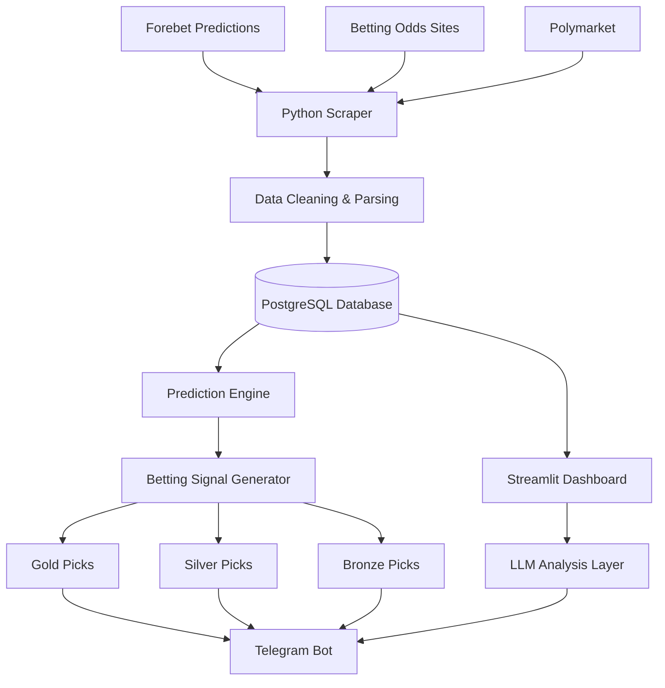

# gAnji Project Flowchart

## Overview
This flowchart illustrates the gAnji betting prediction system architecture, from data collection through signal distribution via Telegram.

## Components
- **Data Sources**: Aggregates predictions from Forebet, odds sites, and Polymarket
- **Processing**: Python scraper handles data extraction and cleaning
- **Storage**: PostgreSQL maintains historical and real-time data
- **Analysis**: Prediction engine generates signals; LLM layer provides insights
- **Output**: Three-tier pick system (Gold/Silver/Bronze) distributed via Telegram and dashboard
